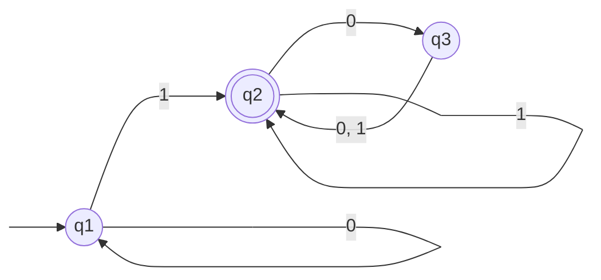
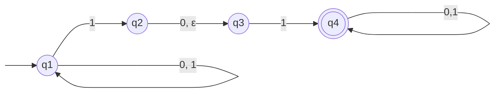

The theory of computation begins with a question: What is a computer? We want an idealized computer called a *computational model*. We will use several different computational models, depending on the features we want to focus on. Let's being with the simplest model, called the *finite state machine* or *finite automaton*.

# Finite Automata
---
Finite automata are good models for computer with an extremely limited amount of memory. What can a computer do with such a small memory? Turns out a lot.

To describe the mathematical theory of finite automata, we do so in the abstract, without reference to any particular application. The following figure depicts a finite automaton called $M_1$ with three states.

The figure above is called the *state diagram* of $M_1$. It has three *states*, labeled $q_1, q_2, q_3$. The *start state* $q_1$ is indicated by the arrow pointing at it from nowhere. The *accept state* $q_2$ is the one with a double circle. The arrows going from one state to another are called *transitions*.

When this automaton receives an input string such as $1101$, it processes that string and produces an output. The output is either *accept* or *reject*. Processing begins in $M_1$'s start state. The automaton receives the symbols from the input string one by one from left to right. After reading each symbol, $M_1$ moves from one state to another along the transition that has the symbol as its label. When it reads the last symbol, $M_1$ produces its output. The output is *accept* if $M_1$ is now in an accept state and *reject* if it is not. 

For example, say we feed the input string $1101$ into the machine $M_1$. Processing proceeds as follows:
1. Start in state $q_1$.
2. Read $1$, follow transition from $q_1$ to $q_2$.
3. Read $1$, follow transition from $q_2$ to $q_2$.
4. Read $0$, follow transition from $q_2$ to $q_3$.
5. Read $1$, follow transition from $q_3$ to $q_2$.
6. *Accept* because $M_1$ is in accept state $q_2$ at the end of input.

$M_1$ accepts any string that ends with a $1$. In addition, it accepts any string with an even number of $0$s following the last $1$. Can you describe the [[Strings and Languages|language]] consisting of all strings that $M_1$ accepts? We'll do so shortly.

## Formal Definition of a Finite Automaton
Instead of using state diagrams let's define finite automata formally. This is useful for two reasons.
1. A formal definition is precise and will resolve uncertainties about what is allowed in a finite automaton.
2. A formal definition provides notation.

A finite automaton has several parts. It has a set of states and rules for going from one state to another, depending on the input symbol. It has an input alphabet that indicates the allowed input symbols. It has a start state and a set of accept states. The formal definition says that a finite automaton is a list of those five objects: set of states, input alphabet, rules for moving, start state, and accept state.

We use something called a *transition function*, denotes $\delta$, to define the rules for moving. If the finite automaton has an arrow from a state $x$ to a state $y$ labeled with the input symbol $1$, that means if the automaton is in state $x$ when it reads a $1$, it then moves to a state $y$.  We indicate this by saying $\delta(x, 1) = y$. 

We arrive at the formal definition of finite automata.

A *finite automaton* is a 5-tuple $\langle Q, \Sigma, \delta, q_0, F\rangle$, where
1. $Q$ is a finite set called the *states*,
2. $\Sigma$ is a finite set called the *alphabet*,
3. $\delta: Q \times \Sigma \to Q$ is the *transition function*,
4. $q_0 \in Q$ is the *start state*, and
5. $F \subseteq Q$ is the *set of accept states*.

We can describe $M_1$ formally by writing $M_1 = \langle Q, \Sigma, \delta, q_1, F\rangle$, where
1. $Q = \{q_1, q_2, q_3\}$,
2. $\Sigma = \{0, 1\}$
3. $\delta(q_1, 0) = q_1, \delta(q_2, 0) = q_3, \delta(q_3, 0) = q_2, \delta(q_1, 1) = q_2, \delta(q_2, 1) = q_2, \delta(q_3, 1) = q_2$
4. $q_1$ is the start state
5. $F = \{q_2\}$.

If $A$ is the set of all strings that machine $M$ accepts, we say that $A$ is the *language of machine M* and write $L(M) = A$. We say that *M recognizes A* or that *M accepts A*. Since *accept* is ambiguous between machines accepting strings and machines accepting languages, we prefer the term *recognize* for languages in order to avoid confusion.

A machine may accept several strings, but it always recognizes only one language. If the machine accepts no strings, it still recognizes one language, name the empty language $\emptyset$.

In our example, let $A = \{w \mid w \text{ contains at least one 1 and an even number of 0s follow that last 1}\}$

Then $L(M_1) = A$ or equivalently, $M_1$ recognizes $A$.

Also note that if a finite automatons start state is also an accept state, it will always accept the empty string $\epsilon$ since as soon as a machine begins reading the empty string, it is at the end.

Also note that describing a finite automaton by state diagram is not possible in some cases. This may occur when the diagram is too big to draw or if the description depends on some unspecified parameter. (Example of the latter given in book see page 40).

## Formal Definition of Computation
Let $M = \langle Q, \Sigma, \delta, q_0, F\rangle$ be a finite automaton and let $w = w_1w_2...w_n$ be a string where each $w_i$ is a member of the alphabet $\Sigma$. Then $M$ accepts $w$ if a sequence of states $r_0,r_1,...,r_n$ in $Q$ exists with three conditions:
1. $r_0 = q_0$
2. $\delta(r_i, w_{i+1}) = r_{i + 1}$, for $i = 0, ..., n-1$, and
3. $r_n \in F$.

Condition 1 says that the machine starts in the start state.
Condition 2 says that the machine goes from state to state according to the transition function.
Condition 3 says that the machine accepts its input if it ends up in an accept state.

We say that $M$ *recognizes language* $A$ if $A = \{w \mid M \text{ accepts }w\}$.

A language is called a *regular language* if some finite automaton recognizes it.

## The Regular Operations
Lets now investigate the properties of finite automata and regular languages.

In arithmetic, the basic objects are numbers and the tools are operations for manipulating them, such as $+$ and $\times$. In the theory of computation, the objects are languages and the tools include operations defined for manipulating them.

We define three operations on languages, called *regular operations* and use them to study the properties of the regular languages.

Let $A$ and $B$ be languages. We define the regular operations *union*, *concatenation*, and *star* as follows:
- **Union**: $A \cup B = \{x \mid x \in A \lor x \in B\}$
- **Concatenation**: $A \circ B = \{xy \mid x \in A \land y \in B\}$
- **Star**: $A^* = \{x_1x_2...x_k \mid k \geq 0 \land \forall x_i \in A\}$

Union takes all the strings in both A and B and lumps them together.
Concatenation attaches a string from A in front of a string from B in all possible ways to get the strings in the new language.
Star attaches any number of strings in A together to get a string in the new language. Since any number includes $0$ as a possibility, the empty string $\epsilon$ is always a member of $A^*$.

It turns out the collection of regular languages is closed under all three of the regular operations. We'll begin with the union operation.

> [!theorem]
> The class of regular languages is closed under the union operation.
> In other words, if $A_1$ and $A_2$ are regular languages, so is $A_1 \cup A_2$

**Proof.** Let $M_1$ recognize $A_1$, where $M_1 = \langle Q_1, \Sigma, \delta_1, q_1, F_1\rangle$. 
Let $M_2$ recognize $A_2$, where $M_2 = \langle Q_2, \Sigma, \delta_2, q_2, F_2\rangle$. 
(Note that since both $A_1$ and $A_2$ are regular languages ex hypothesi there is a finite automaton that recognizes them.)

Construct $M$ to recognize $A_1 \cup A_2$ where $M = \langle Q, \Sigma, \delta, q_0, F\rangle$. 
1. $Q = \{(r_1, r_2) \mid r_1 \in Q_1 \text{ and } r_2 \in Q_2\}$ 
	1. This set is the *Cartesian product* of sets $Q_1$ and $Q_2$ and is written $Q_1 \times Q_2$. It is the set of all pairs of states, the first from $Q_1$ and the second from $Q_2$.
2. $\Sigma$. the alphabet, is the same as in $M_1$ and $M_2$. IN this theorem we assume for simplicity $M_1$ and $M_2$ share the same input alphabet $\Sigma$. The theorem remains true if they have different alphabets $\Sigma_1$ and $\Sigma_2$. We would then modify the proof to let $\Sigma = \Sigma_1 \cup \Sigma_2$.
3. $\delta$, the transition function, is defined as follows. For each $(r_1, r_2) \in Q$ and each $a \in \Sigma$, let $$\delta((r_1, r_2), a) = (\delta(r_1, a), \delta(r_2, a)).$$
4. $q_0$ is the pair $(q_1, q_2)$
5. $F$ is the set of pairs in which either member is an accept state of $M_1$ or $M_2$: $$F = \{(r_1, r_2)\mid r_1 \in F_1 \text{ or } r_2 \in F_2\}.$$ This expression is the same as $$F = (F_1 \times Q_2) \cup (Q_1 \times F_2).$$
This concludes the construction of the finite automaton $M$ that recognizes the union of $A_1$ and $A_2$. The construction is simple, and thus correctness is evident from the strategy described in the proof idea. More complicated constructions require additional discussion to prove correctness.

We have just shown the union of two regular languages is regular, thereby proving that the class of regular languages is closed under the union operation. Now lets turn to concatenation.

> [!theorem]
> The class of regular languages is closed under the concatenation operation.
> In other words, if $A_1$ and $A_2$ are regular languages then so is $A_1 \circ A_2$.

Lets start with finite automata $M_1$ and $M_2$ recognizing the regular languages $A_1$ and $A_2$. Now instead of constructing automaton $M$ to accept its input if either $M_1$ or $M_2$ accept, it must accept if its input can be broken into two pieces, where $M_1$ accepts the first piece and $M_2$ accepts the second piece. 

The problem is that $M$ doesn’t know where to break its input (i.e., where the first part ends and the second begins). 

To solve this problem, we introduce a new technique called nondeterminism.

# Nondeterminism
---
So far in our discussion, every step of a computation follows in a unique way from the preceding step. When the machine is in a given state and reads the next input symbol, we know what the next state will be it, it is determined. We call this *deterministic* computation. In a *nondeterministic* machine, several choices may exist for the next state at any point.

Nondeterminism is a generalization of determinism, so every deterministic finite automaton is automatically a nondeterministic finite automaton.

Every state of a DFA always has exactly one existing transition arrow for each symbol in the alphabet. The NFA show in the figure below violates that rule, call it $N_1$

State $q_1$ has one existing arrow for $0$ but it has two for $1$; $q_2$ has one arrow for $0$ but none for $1$.  In an NFA, a state may have zero, one, or many exiting arrows for each alphabet symbol.

In a DFA, labels on the transition arrows are symbols from the alphabet. This NFA has an arrow with the label $\epsilon$. An NFA May have arrows labeled with members of the alphabet or $\epsilon$. Zero, one, or many exit from each state with the label $\epsilon$.

How does an NFA compute? Suppose we are running an NFA on an input string and come to a state with multiple ways to proceed. After reading that symbol, the machine splits into multiple copies of itself and follows *all* the possibilities in parallel. Each copy of the machine takes one of the possible ways to proceed and continues as before. If there are subsequent choices, the machine splits again. If the next input symbol doesn't appear on any of the arrows exiting the state occupied by a copy of the machine, the copy of the machine, along with the branch of the computation associated with it. If *any one* of these copies of the machine is in an accept state at the end of the input, the NFA accepts the input string.

If a state with an $\epsilon$ symbol on an exiting arrow is encountered, without reading any input, the machine splits into multiple copies, one following each of the exiting $\epsilon$-labeled arrows and one staying at the current state. Then the machine proceeds nondeterministically as before.

Nondeterminism may be viewed as a kind of parallel computation wherein multiple independent "processes" or "threads" can be running concurrently. The NFA splitting to follow several choices corresponds to a process "forking" into several children, each proceeding separately. If at least one of these processes accepts, the entire computation accepts.

You can also think of this as a tree of possibilities. The root of the tree corresponds to the start of the computation. Every branching point in the tree corresponds to a point in the computation at which the machine has multiple choices. If at least one of the branches ends in an accept state the machine accepts.

NFAs are useful in several respects. As we'll show every NFA can be converted into an equivalent DFA, and constructing NFAs is sometimes easier than directly constructing DFAs. An NFA may be much smaller than its deterministic counterpart, or its functioning may be easier to understand.

## Formal Definition of a Nondeterministic Finite Automaton
The formal definition of a NFA is similar to that of a DFA. Both have states, an input alphabet, a transition function, a start state, and a collection of accept states. They differ in one essential way: the type of transition function.

In a DFA, the transition function takes a state and an input symbol and produces the next state. In an NFA, the transition function takes a state and an input symbol *or the empty string* and produces *the set of possible next states*.

For any set $Q$ we write $\mathcal{P}(Q)$ to be the collection of all subsets of $Q$ i.e. the power set of Q. For any alphabet $\Sigma$ we write $\Sigma_{\epsilon}$ to be $\Sigma \cup  \{\epsilon\}$. The type of transition function in an NFA is $\delta: Q \times \Sigma_{\epsilon} \to \mathcal{P}(Q)$.

A *nondeterministic finite automaton* is a 5-tuple $\langle Q, \Sigma, \delta, q_0, F\rangle$, where
1. $Q$ is a finite set called the *states*,
2. $\Sigma$ is a finite set called the *alphabet*,
3. $\delta: Q \times \Sigma_{\epsilon} \to \mathcal{P}(Q)$ is the *transition function*,
4. $q_0 \in Q$ is the *start state*, and
5. $F \subseteq Q$ is the *set of accept states*.

The formal description of $N_1$ is $\langle Q, \Sigma, \delta, q_0, F\rangle$, where
1. $Q = \{q_1, q_2, q_3, q_4\}$
2. $\Sigma = \{0, 1\}$
3. $\delta(q_1, 0) = \{q_1\}, \delta(q_2, 0) = \{q_3\}, \delta(q_3, 0) = \emptyset, \delta(q_4, 0) = \{q_4\}, \delta(q_1, 1) = \{q_1, q_2\}, \delta(q_2, 1) = \emptyset, \delta(q_3, 1) = \{q_4\}, \delta(q_4, 1) = \{q_4\}, \delta(q_1, \epsilon) = \emptyset, \delta(q_2, \epsilon) = \{q_3\}, \delta(q_3, \epsilon) = \emptyset, \delta(q_4, \epsilon) = \emptyset$
4. $q_1$ is the start state
5. $F = \{q_4\}$.

The formal definition of computation for an NFA is similar to that for a DFA.

Let $N =\langle Q, \Sigma, \delta, q_0, F\rangle$ be an NFA and $w$ a string over the alphabet $\Sigma$. We say that $N$ *accepts* $w$ if we can write $w$ as $y_1y_2...y_m$, where each $y_i$ is a member of $\Sigma_{\epsilon}$ and a sequence of states $r_0, r_1, ..., r_m$ exists in $Q$ with three conditions.
1. $r_0 = q_0$,
2. $r_{i+1} \in \delta(r_i, y_{i+1})$, for $i=0,...,m-1$, and
3. $r_m \in F$.

Condition 1 says that the machine starts out in the start state.
Condition 2 says that the state $r_{i+1}$ is one of the allowable next states when $N$ is in state $r$, and reading $y_{i+1}$ (observe that $\delta(r_i, y_{i+1})$ is the *set* of allowable next states and so we say $r_{i+1}$ is a member of that set).
Condition 3 says that the machine accepts its input if the last state is an accept state.

## Equivalence of NFAs and DFAs
Deterministic and nondeterministic finite automata recognize the same class of languages.  Say that two machines are *equivalent* if they recognize the same language.

> [!theorem] 
> Every nondeterministic finite automaton has an equivalent deterministic finite automataon.

**Proof.** Let $N = \langle Q, \Sigma, \delta, q_0, F\rangle$ be the NFA recognizing some language $A$. We construct a DFA $M = \langle Q', \Sigma, \delta', q_0', F'\rangle$ recognizing $A$. First consider the easy case wherein $N$ has no $\epsilon$ arrows.
1. $Q' = \mathcal{P}(Q)$.
2. For $R \in Q'$ and $a \in \Sigma$, let $\delta'(R, a) = \{q \in Q \mid q \in \delta(r, a) \text{ for some } r \in R\}$. We can also write this as: $$\delta'(R, a) = \bigcup_{r\in R}\delta(r, a)$$
3. $q_0' = \{q_0\}$.
4. $F' = \{R \in Q' \mid R \text{ contains an accept state of N}\}$.

Now consider the $\epsilon$ arrows. For any state $R$ of $M$, we define $E(R)$ to be the collection of states that can be reached from members of $R$ by going only along $\epsilon$ arrows, including the members of $R$ themselves. Formally, for $R \subseteq Q$ let $$E(R) = \{q \in Q \mid q \in E(\delta(r, a)) \text{ for some }r \in R\}.$$
Then we modify the transition function of $M$ to place additional fingers on all states that can eb reached by going along $\epsilon$ arrows after every step. Replacing $\delta(r, a)$ by $E(\delta(r, a))$ achieves this effect. Thus $$\delta'(R,a) = \{q \in Q \mid q \in E(\delta(r, a)) \text{ for some }r \in R\}.$$
Additionally, we need to modify the start state of $M$ to move the fingers initially to all possible states that can be reached from the start state of $N$ along the $\epsilon$ arrows. Changing $q_0'$ to be $E(\{q_0\})$ achieves this effect. We've now completed the construction of the DFA $M$ that simulates the NFA $N$.

The construction of $M$ obviously works correctly. At every step in the computation of $M$ on an input, it clearly enters a state that corresponds to the subset of states that $N$ could be in at that point. Thus our proof is complete.

Since every NFA can be converted into an equivalent DFA, NFA's give us an alternative way of characterizing the regular languages. We state this fact as a corollary.

> [!corollary]
> A language is regular if and only if some nondeterministic finite automaton recognizes it.

## Closed Under the Regular Operations
We abandoned are original attempt to prove that regular languages are closed under union, concatenation, and star because to do so would be too complicated without the use of nondeterminism.

>[!theorem]
>The class of regular languages is closed under the union operation.

**Proof.** Let $N_1 = \langle Q_1, \Sigma, \delta_1, q_1, F_1 \rangle$ recognize $A_1$ and $N_1 = \langle Q_2, \Sigma, \delta_2, q_2, F_2\rangle$ recognize $A_2$. 

Construct $N = \langle Q, \Sigma, \delta, q_0, F\rangle$ to recognize $A_1 \cup A_2$.
1. $Q = \{q_0\} \cup Q_1 \cup Q_2$
2. The state $q_0$ is the start state of $N$.
3. The set of accept states $F = F_1 \cup F_2$
4. Define $\delta$ s.t. $\forall q \in Q$ and $\forall a \in \Sigma_{\epsilon}$ $$\delta(q, a) = \cases{\delta_1(q, a) & $q \in Q_1$\\\delta_2(q, a) & $q\in Q_2$\\\{q_1, q_2\} & $q=q_0$ and $a = \epsilon$\\\emptyset & $q=q_0$ and $a\neq\epsilon$}$$
>[!theorem]
>The class of regular languages is closed under the concatenation operation.

**Proof.** Let $N_1 = \langle Q_1, \Sigma, \delta_1, q_1, F_1 \rangle$ recognize $A_1$ and $N_1 = \langle Q_2, \Sigma, \delta_2, q_2, F_2\rangle$ recognize $A_2$. 

Construct $N = \langle Q, \Sigma, \delta, q_1, F_2\rangle$ to recognize $A_1 \circ A_2$.
1. $Q = Q_1 \cup Q_2$
2. The start state $q_1$ is the same start state as $N_1$.
3. The set of accept states $F_2$ is the same as the accept states of $N_2$
4. Define $\delta$ s.t. $\forall q \in Q$ and $\forall a \in \Sigma_{\epsilon}$ $$\delta(q, a) = \cases{\delta_1(q, a) & $q \in Q_1$ and $q \notin F_1$\\\delta_1(q, a) & $q\in F_1$ and $a \neq \epsilon$\\\delta_1(q, a)\cup\{q_2\} & $q\in F_1$ and $a = \epsilon$\\\delta_2(q, a) & $q\in Q_2$.}$$
>[!theorem]
>The class of regular languages is closed under the star operation.

**Proof.** Let $N_1 = \langle Q_1, \Sigma, \delta_1, q_1, F_1 \rangle$ recognize $A_1$.

Construct $N = \langle Q, \Sigma, \delta, q_0, F\rangle$ to recognize $A_1^*$.
1. $Q = \{q_0\} \cup Q_1$
2. The start state $q_0$ is the new start state.
3. $F = \{q_0\}  \cup F_1$.
4. Define $\delta$ s.t. $\forall q \in Q$ and $\forall a \in \Sigma_{\epsilon}$ $$\delta(q, a) = \cases{\delta_1(q, a) & $q \in Q_1$ and $q \notin F_1$\\\delta_1(q, a) & $q\in F_1$ and $a \neq \epsilon$\\\delta_1(q, a)\cup\{q_1\} & $q\in F_1$ and $a = \epsilon$\\\{q_1\} & $q = q_0$ and $a = \epsilon$\\\emptyset & $q=q_0$ and $a \neq \epsilon$.}$$

# Regular Expressions
---
## Formal Definition of a Regular Expression
Say that $R$ is a *regular expression* if $R$ is
1. $a$ for some $a$ in the alphabet $\Sigma$,
2. $\epsilon$
3. $\emptyset$
4. $(R_1 \cup R_2)$, where $R_1$ and $R_2$ are regular expressions,
5. $(R_1 \circ R_2)$, where $R_1$ and $R_2$ are regular expressions, or
6. $(R_1^*)$, where $R_1$ is a regular expression.

In items 1 and 2, the regular expressions $a$ and $\epsilon$ represent the languages $\{a\}$ and $\{\epsilon\}$, respectively. In item 3, the regular expression $\emptyset$ represents the empty language. In items 4, 5, 6, the expressions represent the languages obtained by the regular operations.

Don't confuse the regular expressions $\epsilon$ and $\emptyset$. The expression $\epsilon$ represents the language containing a single string, the empty string, whereas $\emptyset$ represents the language that doesn't contain any strings.

A definition of this type is called an *inductive definition*. When want to distinguish between a regular expression $R$ and the language that it describes, we write $L(R)$ to be the language of $R$.

Here are some examples, in the them we assume the alphabet $\Sigma = \{0, 1\}$.
1. $0^*10^* = \{w \mid w \text{ contains a single }1\}$
2. $\Sigma^*1\Sigma^* = \{w \mid w \text{ has at least one }1\}$
3. $\Sigma^*001\Sigma^* = \{w \mid w \text{ contains the string }001\text{ as a substring}\}$
4. $(\Sigma\Sigma)^* = \{w \mid w \text{ is a string of even length}\}$
5. $1^*\emptyset = \emptyset$ (concatenating the empty string to any set yields the empty set).
6. $\emptyset^* = \{\epsilon\}$

If we let $R$ be any regular expression, we have the following identities.
$$R \cup \emptyset = R$$$$R \circ \epsilon = R$$
The identities don't hold if you exchange $\emptyset$ and $\epsilon$.

## Equivalence with Finite Automata
Regular expressions and finite automata are equivalent in their descriptive power. Any regular expression can be converted into a finite automaton that recognizes the language it describes, and vice versa. Recall that a regular language is one that is recognized by some finite automaton.

> [!theorem]
> A language is regular if and only if some regular expression describes it.

Refer to Sisper for the proof, page 67. It's pretty obvious though. One of the proofs requires a new type of finite automata called a *generalized nondeterministic finite automaton*, GNFA. I'll describe that here.

GNFAs are NFAs wherein the transition arrows may have any regular expression as labels, instead of only members of the alphabet or $\epsilon$. GNFA's read blocks of symbols from the input, not necessarily just one symbol at a time like an ordinary NFA.

A GNFA is similar to a nondeterministic finite automaton except for the transition function, which has the form $$\delta: (Q-\{q_{accept}\}) \times (Q-\{q_{start}\}) \to \mathcal{R}$$
Where $\mathcal{R}$ is the collection of all regular expressions over the alphabet $\Sigma$.
# Nonregular Languages
---
To understand the power of finite automata, you must understand their limitations.

Take the language $B = \{0^n1^n \mid n \geq 0\}$. If we attempt to find a DFA that recognizes $B$, we discover that the machine seems to need to remember how many $0$s have been seen so far as it reads in the input. Since the number of $0$s isn't limited, the machine will have to keep track of an unlimited number of possibilities. But it cannot do so with any finite number of states.

We present a method for proving that languages such as $B$ are not regular. The argument above isn't satisfactory to prove $B$ isn't regular. Just because a language appears to require unbounded memory doesn't mean that it is necessarily so. Other languages seem to require an unlimited number of possibilities but are actually regular. Consider the following two languages over the alphabet $\Sigma = \{0, 1\}$:

$C = \{w \mid w \text{ has an equal number of 0s and 1s}\}$
$D = \{w \mid w \text{ has an equal number of occurrences of 01 and 10 as substrings}\}$

$C$ isn't regular, but $D$ is! Our intuition may lead us astray, we need mathematical proof.

## The Pumping Lemma for Regular Languages
Our technique for proving non-regularity stems from a theorem about regular languages, called the *pumping lemma*. The theorem states that all regular languages have a special property. If we show a language doesn't have this property, we are guaranteed that it isn't regular. The property states that all strings in the language can be "pumped" if they are at least as long as a certain special value, called the *pumping length*. This means each such string contains a section that can be repeated any number of times with the resulting string remaining in the language.

> [!theorem] Pumping lemma
> If $A$ is a regular language, then there is a number $p$, the pumping length, where if $s$ is any string in $A$ of length at least $p$, then $s$ may be divided into three pieces, $s = xyz$, satisfying the following conditions:
> 1. for each $i \geq 0, xy^iz \in A$,
> 2. $|y| > 0$, and
> 3. $|xy| \leq p$

where $y^i$ means that $i$ copies of y are concatenated together, and $y^0$ equals $\epsilon$.

**Proof.** See Sisper. page 80

