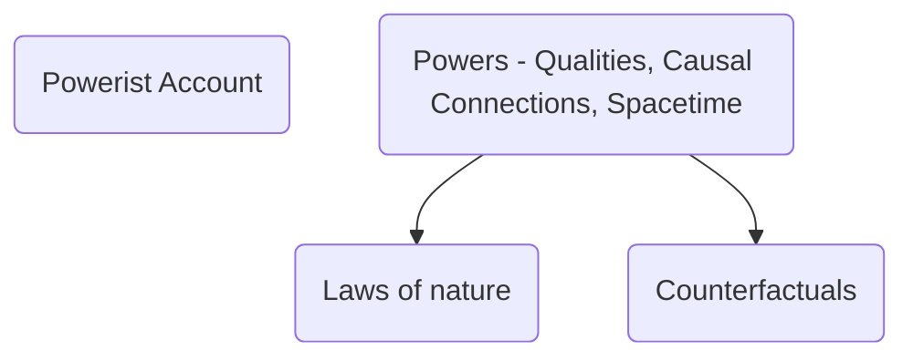
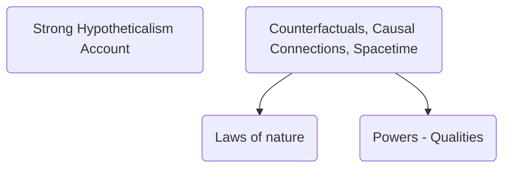
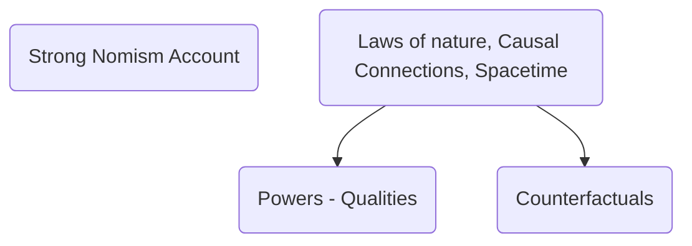
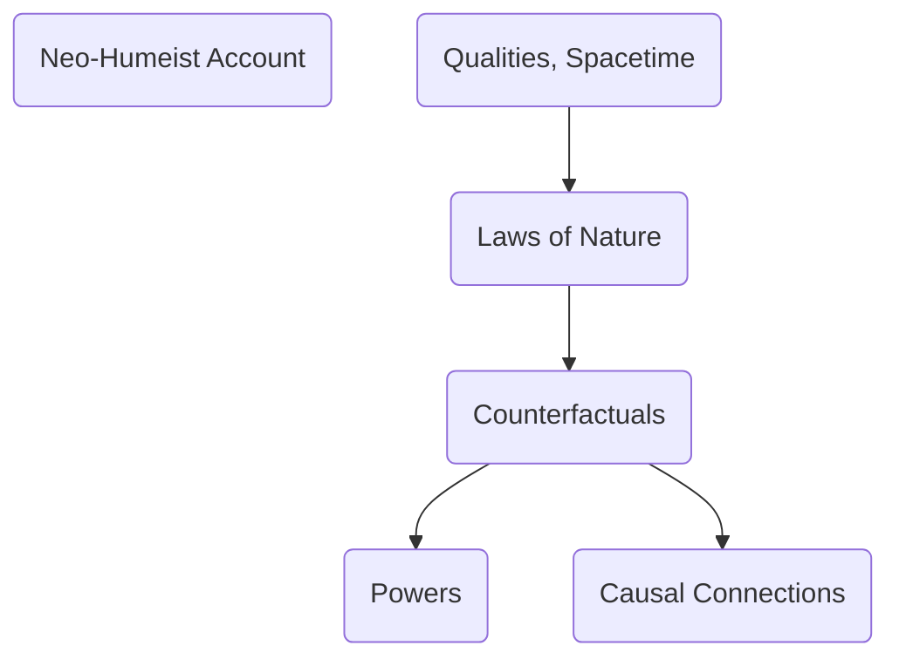

Since Aristotle, Philosophers have recognized that the properties of things comes in two kinds:
- The way things are in fact (actuality)
- The way things could be but aren't (potentiality)

Potentialities are properties that things actually have. I'm potentially a speaker of Italian, but I have that potentiality in actuality. The potentiality itself is actual, even if the property that is had potentially is only potential.

There is a dichotomy between two kinds of properties: those properties that attribute some kind of mere potentiality to things, and those that don't.

Metaphysicians use the term 'categorical' for verbs, adjectives, and predicates that designate properties that are only about the actual world, and 'dispositional' for those terms that are also about what could potentially be the case.

Categorical properties are designated by categorical terms, dispositional properties are designated by dispositional terms.

Dispositional properties typically involve potential facts by way of some condition. For example, a fragile object is one that is potentially broken, in the sense that it would break if struck with sufficient force. Consequently, one popular approach to the metaphysics of dispositional properties takes them to involve ascribing a conditional property corresponding to a [[Conditionals|conditional statement]].

This gives rise to the question, what makes a conditional statement true? Answers fall into four categories:
1. Conditional statements are fundamental truths, of which no further account can be given (Hypotheticalism)
2. Conditional statements are made true by the world's laws of nature (Nomism)
3. Conditional statements are made true by the actual distribution of categorical properties (Neo-Humean)
4. Conditional statements are made true by the powers of things (Powerism).

# Counterfactual Conditionals: Semantics, Logic, and Metaphysics
---
For semantics see: [[Conditionals]]

Quine classified counterfactual conditionals as "creatures of darkness", because they did not correspond to any of the formulas of classical extensional logic. The truth-value of a counterfactual is not a function of the truth-value of its parts.

Work by Stalnaker and Lewis rescued counterfactuals from Quine's ban. This led to the revival of a conditional theory of dispositions, proposed by Ryle and largely abandoned as a result of Quinean anxieties about the meaning of conditionals.

The conditional theory of dispositions suggests that having a disposition like fragility consists in making true a conditional. The truth of:

"The vase is fragile."

is grounded in:

"If struck, the vase would break."

Is there reason to believe that "if struck, the vase would break." is the fundamental truth and "the vase is fragile" derived, rather than the other way around? Can there be be fundamental conditional truths? There seems to be two options here:

>[!thesis_name] Hypotheticalism.
>There are fundamentally conditional or hypothetical truths.

>[!thesis_name] Anti-Hypotheticalism.
>All conditional truths are grounded in non-conditional facts.

# Hypotheticalism
---
What would the world be like if Hypotheticalism were true? One possibility would be for there to be simple conditional truthmakers: basic, irreducible facts to the effect that if p (subjunctive mood) then q (subjunctive mood).

Alternatively, given Lewis's semantics of counterfactuals, there could be basic facts of comparative closeness between possible worlds. Facts of the form: world $w'$ is one of the closest $p$-worlds to $w''$. These facts of closeness would be very much like simple conditional facts, since they tell us which worlds might have been actual (from the viewpoint of $w'$) had $p$ been true.  These facts about closeness between worlds could exist, if possible worlds were themselves fundamental entities, as David Lewis believed them to be.  To use Stalnaker's semantics, there might be fundamental truths about which one world have been actual, had some members of a set of worlds been actual.

Hypotheticalism has had its defenders, both historically (Luis de Molina) and among contemporary metaphysicians (Plantinga).  It stands in some tension with both [[Truthmakers|truthmaker theory]]  and [[Truthmakers#Truth Supervenes on Being|Truth Supervenes on Being]]. However, it's possible to believe in Hypotheticalism while embracing either.

One way of doing this would be treating possible worlds as real, concrete entities existing in "logical space", a view called Concretism. Alternatively, one could posit simple hypothetical truthmakers in the actual world whose existence is sufficient to make some counterfactual conditional true. Luis Molina does this by introducing special primitive properties, which he called 'habitudes'.

If it's true that Curley the mayor would have accepted a $300,000 bribe, had he been offered one, we could suppose that this conditional is made true by virtue of Curley's having the appropriate habitude property: the property of being the sort of person who would accept a $300,000 bribe if offered one.

Importantly, although these habitudes are properties of individuals, they are not *intrinsic* properties of them. If a habitude were part of the intrinsic nature of a thing, then the unique result associated with the habitude would be pre-determined by Curry's nature. If we suppose the truth of conditionals to be grounded in the intrinsic nature of things, we've moved to a Strong Powerist position, not Hypotheticalism. Consequently, for Hypotheticalists a habitude must be an external relation, rather than an internal relation, between an individual and some non-actual state of affairs.

What about non-actual individuals? Suppose the Pope had children, might any of them have accepted a bribe? This question is much harder. Molina supposed that even merely possible individuals can have habitudes.

Plantinga however, argues that only existing things can have properties. Instead, he makes use of the corresponding *haecceities*. According to Plantinga, each actually existing things, like Socrates, has its own unique thisness. Socrates is unique in having the property of *Socraeity*, the property of *being Socrates*. Nothing else could possibly have that property. Since Socrates might not have existed, this property of *Socrateity* might have no actual instances. Since there could have been things that don't actually exist, Plantinga infers that there are many thisnesses that lack their corresponding instances in the actual world. There might be an un-actualized thisness, which, had it been actualized, would have been an child of the Pope, and which would have been accompanied or co-instantiated by the habitude of being the sort of person who would have accepted a $300,000 bribe if offered one.

Plantinga's neo-Molinist account seems to be a lot to swallow. We have to accept both un-actualized thisnesses and the peculiar, simple, and extrinsic habitude properties. It's reasonable to look for an alternative with fewer somewhat mysterious and sui generis entities and properties.

# Anti-Hypotheticalism and Laws of Nature
---
Anti-Hypotheticalism is the view that the truth of conditionals is conceptually or logically grounded in non-conditional facts. The evaluation of conditions seems to turn on two sorts of facts about the actual world: the laws of nature, and the true propositions that are co-tenable with the conditional's antecedent. If we know these two sets of truths, we could define which antecedent-verifying worlds are 'closest' in the relevant sense to the actual world.

One possibility, then, is that of the truth of counterfactual conditionals is wholly grounded in truths about the laws of nature. What are the laws of nature? To be a law of nature is not simply to be a true universal generalization. In fact, being a true universal generalization is neither necessary nor sufficient for being a law of nature.

It's not sufficient because true universal generalizations like "all the coins in my pocket are bronze" are obviously not laws of nature.

More interestingly, laws of nature need not hold without exceptions. Some laws are "oaken" rather than "iron" to use David Armstrong's distinction. Laws of biology and economics seem to admit exceptions. For example, Birds fly, but ostriches, penguins, and dodos do not. (These do not seem like instances of laws of nature to me).

Are the laws of nature metaphysically fundamental or are they grounded in still more basic truths? If they're derived truths, what do they derive from? If laws are not fundamental there are at least three possibilities:
1. The laws of nature are grounded in the truths of counterfactual conditionals.
2. They're grounded in truths about powers and dispositions of particular things
3. They're grounded in other truths about particular things that have nothing to do with powers and dispositions.

What would the world look like if the laws of nature were fundamental?  [[Laws of Nature|The Dretske/Armstrong/Tooely, or DAT, account of laws]] holds that a law consists in a special, irreducible relation of nomological necessity connecting one or more properties or universals. For example. if it were a law of nature that water freezes at 0 Celsius , then this law would consist in a special nomic link between the property of being water at 0 celsius and that of becoming frozen.

Laws could, however, be reduced to counterfactuals. We could define a law of nature as a truth that would remain true under any antecedent that does not falsify any law of nature or any law of logic. Put this way, the definition is circular. The circularity can be eliminated by defining the laws of nature as the smallest set of truths T such that every member of T would remain true under any antecedent not falsifying any member of T. Such a reduction would be on interest only to Hypotheticalists, since Anti-Hypotheticalists assumes that the truth of conditionals is grounded in that of laws and not vice versa.

Could the laws of nature be grounded in the powers and dispositions of particulars? The law that ice freezes at 0 Celsius could be grounded in the passive power of water to freeze when its temperature is lowered to 0 Celsisus. Any causal law of nature could be expressed in terms of all of the instances of one kind of thing A having an active power to affect any instances of a second kind of thing B when the two are in a certain relation R, producing the result that the second thing takes on a new characteristic C. 

Law could be taken as simply expressing the fact that all A's have the active power of producing effect C in any R-related B or that all B's have the passive power of being made C by any R-related A.

Powers and dispositions come in five varieties: active powers, passive powers, immanent powers, resultants, and tendencies.

>[!def] Active Power
>A property P is an active power if and only if, necessarily, whenever a thing has P there is the possibility of its producing a specific kind of effect E on some other thing under specifiable conditions by virtue of having P.

>[!def] Passive Power
>A  property P is a passive power if and only if, necessarily, whenever a thing has P there is the possibility of its being affected in some specific way E by some other thing under specifiable conditions by virtue of having P.

>[!def] Immanent Power
>A property P is an immanent power if and only if, necessarily, whenever a thing has P there is possibility of its producing some intrinsic change in itself under specifiable conditions by virtue of having P.

>[!def] Resultant
> A property P is a resultant if and only if, necessarily, whenever a thing x has P at t, there is some earlier time t′ and some passive or immanent power M such that x has P at t by virtue of its having exercised M at t′.

>[!def] Tendency
> A property P is a tendency if and only if, necessarily, whenever a thing has P there is a certain likelihood or propensity for it to exercise one of its active or immanent powers under specifiable circumstances by virtue of having P.

'Powers' and 'dispositions' will be used interchangeably as general terms for any property of any of these five kinds. Are truths about the powers of things fundamental or derived?

>[!thesis] Power Fundamentalism
>Some truths about the powers of particular things are fundamental

>[!thesis] Power Reductionism
>No truths about powers are fundamental

If powers are not fundamental, there are at least two plausible accounts of how they can be derived from other truths. They're derivable either from truths about the laws of nature or from truths about counterfactual conditionals.

There are thus four attractive positions: Strong Hypotheticalism (conditionals are fundamental, but not powers or laws), Strong Nomism (laws are fundamental, but not powers or conditionals), Strong Powerism (powers are fundamental, but not laws or conditionals), and Neo-Humeism (none of the three are fundamental).

Diagrams of the differences between accounts:

The Neo-Humeist view is unique in having a simpler base and by involving two steps of reduction: reducing laws to the "Humean Mosaic" of qualities in spacetime, and then reducing powers, causal connections, and counterfactuals to the laws of nature (together with the mosaic).

If we were to reject all four positions, there would be only two options.
1. Suppose along with Quine that there are no truths of any kind in this area, no true conditionals, laws of nature, or attributions of powers.
2. We could suppose that two or more of the classes of propositions have their own, distinctive truth-makers.

